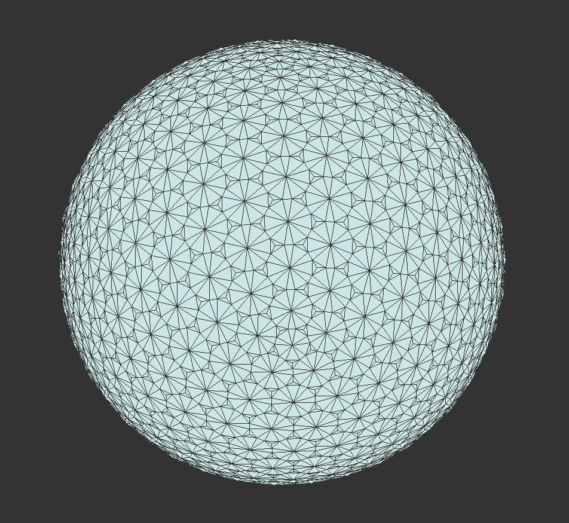

# IntrinsicDelaunayMesh

## Purpose
For a given triangular mesh (2D or 3D), flip the edges so that the two triangle
sharing an edge are locally Delaunay.

User can also restrict flipping the edges along the sharp creases by specifying
the "Crease Angle".

## Example

##i License
As free as Air.

